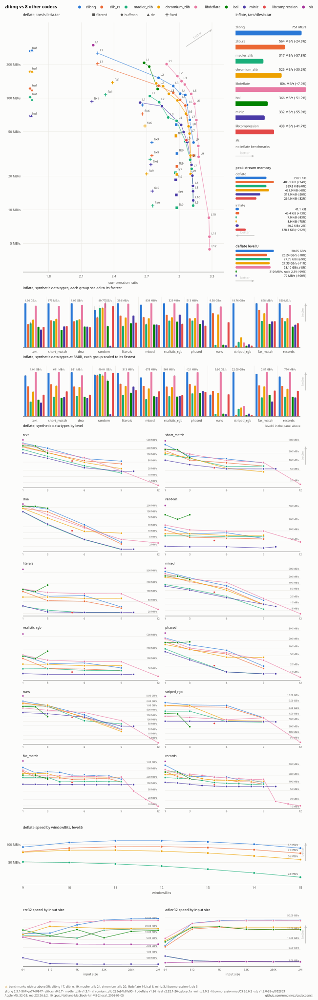

# codecbench

Whole-buffer deflate benchmarks across implementations.

The same benchmark source builds once per codec backend, so every executable
registers identical benchmark names over the corpora files and synthetic data
types. Their JSON outputs compare directly with `scripts/compare_runs.py`.
Decompression input is always produced by zlib-ng at level 9, so every backend
inflates identical streams, and all output is verified against the original
data through zlib-ng.

## Backends

| Executable                 | Backend                     | Option              | Requires        |
| -------------------------- | --------------------------- | ------------------- | --------------- |
| `codecbench_zlibng`        | [zlib-ng] (reference)       | always              |                 |
| `codecbench_libdeflate`    | [libdeflate]                | `WITH_LIBDEFLATE`   |                 |
| `codecbench_isal`          | [ISA-L] (igzip)             | `WITH_ISAL`         | nasm on x86     |
| `codecbench_slz`           | [libslz] (compress only)    | `WITH_SLZ`          |                 |
| `codecbench_chromium_zlib` | [Chromium zlib]             | `WITH_CHROMIUM_ZLIB`|                 |
| `codecbench_madler_zlib`   | [madler zlib]               | `WITH_MADLER_ZLIB`  |                 |
| `codecbench_zlib_rs`       | [zlib-rs]                   | `WITH_ZLIB_RS`      | cargo           |
| `codecbench_miniz`         | [miniz]                     | `WITH_MINIZ`        |                 |
| `codecbench_libcompression`| [libcompression]            | `WITH_LIBCOMPRESSION`| macOS          |

[zlib-ng]: https://github.com/zlib-ng/zlib-ng
[libdeflate]: https://github.com/ebiggers/libdeflate
[ISA-L]: https://github.com/intel/isa-l
[libslz]: https://github.com/wtarreau/libslz
[Chromium zlib]: https://chromium.googlesource.com/chromium/src/third_party/zlib
[madler zlib]: https://github.com/madler/zlib
[zlib-rs]: https://github.com/trifectatechfoundation/zlib-rs
[miniz]: https://github.com/richgel999/miniz
[libcompression]: https://developer.apple.com/documentation/compression

All backends are on by default and fetched at pinned versions during the CMake
configure. Each `<NAME>_REPOSITORY` / `<NAME>_TAG` pair can be overridden.
Levels follow what each backend supports, libdeflate adds `level:12`, miniz
adds `level:10`, igzip spans 0-3, libslz has a single level, and
libcompression's single fixed quality registers as `level:5`. Deflate
strategy variants (`/strategy:filtered` etc.) register for zlib-ng, the
stock zlib API backends (Chromium zlib, madler zlib, zlib-rs), and miniz.
libdeflate, igzip, libslz, and libcompression have no equivalent.

## Building

```sh
git clone https://github.com/zlib-ng/corpora test/data/corpora
cmake -B build
cmake --build build -j
```

## Test data

The corpora clone provides the per-file corpora. For single-stream runs
comparable with [deflatebench], put its uncompressed Silesia tars in a
corpora subdirectory (e.g. `test/data/corpora/tars/`):

* [203MiB full Silesia testcorpus](https://mirror.circlestorm.org/silesia.tar)
* [44MiB custom cropped Silesia testcorpus](https://mirror.circlestorm.org/silesia-medium.tar)
* [16MiB custom cropped Silesia testcorpus](https://mirror.circlestorm.org/silesia-small.tar)

The original source of this testcorpus is
[Silesia](http://sun.aei.polsl.pl/~sdeor/index.php?page=silesia).

[deflatebench]: https://github.com/zlib-ng/deflatebench

## Running

```sh
build/codecbench_zlibng --benchmark_list_tests=true
build/codecbench_zlibng --benchmark_filter="silesia" --benchmark_data_types=all
```

`--benchmark_data_types=<type,...|all>` selects the synthetic inputs (text,
short_match, dna, random, literals, mixed, realistic_rgb, striped_rgb),
registering deflate variants per level plus an inflate variant for each.
zlib API backends also report peak per-stream bytes as a `mem` counter.
`--benchmark_cooldown=<seconds>` sleeps between benchmark families to mitigate
thermal throttling.

## Comparing

```sh
build/codecbench_zlibng --benchmark_out=zlibng.json --benchmark_out_format=json
build/codecbench_libdeflate --benchmark_out=libdeflate.json --benchmark_out_format=json
scripts/compare_runs.py zlibng.json libdeflate.json
```

## Graphing

`scripts/graph_runs.py` turns two or more runs into a speed versus ratio SVG,
one point per level and strategy aggregated across the corpus files common to
the runs, with inflate throughput, data-type line panels, repetition error
bars, delta annotations, and machine specs. An aggregate table prints to
stdout. It needs only the Python standard library.

```sh
scripts/graph_runs.py zlibng.json libdeflate.json -o zlibng_vs_libdeflate.svg
```

All nine backends on silesia.tar:



## Benchmarking a local zlib-ng

Point the reference backend at a checkout instead of the pinned release to
measure work in progress:

```sh
cmake -B build -D ZLIBNG_SOURCE_DIR=~/Source/zlib-ng
cmake --build build -j
```
