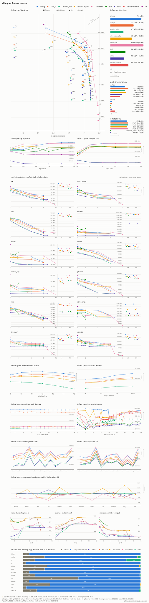

# codecbench

Whole-buffer deflate benchmarks across implementations.

One benchmark source builds once per backend, every executable registers the
same benchmark names, and the JSON outputs compare directly with
`scripts/compare_runs.py`. Every backend inflates identical zlib-ng level 9
streams, and all output is verified against the original data.

## Backends

| Executable                 | Backend                     | Option              | Requires        |
| -------------------------- | --------------------------- | ------------------- | --------------- |
| `codecbench_zlibng`        | [zlib-ng] (reference)       | always              |                 |
| `codecbench_libdeflate`    | [libdeflate]                | `WITH_LIBDEFLATE`   |                 |
| `codecbench_isal`          | [ISA-L] (igzip)             | `WITH_ISAL`         | nasm on x86     |
| `codecbench_slz`           | [libslz] (compress only)    | `WITH_SLZ`          |                 |
| `codecbench_chromium_zlib` | [Chromium zlib]             | `WITH_CHROMIUM_ZLIB`|                 |
| `codecbench_madler_zlib`   | [madler zlib]               | `WITH_MADLER_ZLIB`  |                 |
| `codecbench_zlib_rs`       | [zlib-rs]                   | `WITH_ZLIB_RS`      | cargo           |
| `codecbench_miniz`         | [miniz]                     | `WITH_MINIZ`        |                 |
| `codecbench_libcompression`| [libcompression]            | `WITH_LIBCOMPRESSION`| macOS          |

[zlib-ng]: https://github.com/zlib-ng/zlib-ng
[libdeflate]: https://github.com/ebiggers/libdeflate
[ISA-L]: https://github.com/intel/isa-l
[libslz]: https://github.com/wtarreau/libslz
[Chromium zlib]: https://chromium.googlesource.com/chromium/src/third_party/zlib
[madler zlib]: https://github.com/madler/zlib
[zlib-rs]: https://github.com/trifectatechfoundation/zlib-rs
[miniz]: https://github.com/richgel999/miniz
[libcompression]: https://developer.apple.com/documentation/compression

## Building

```sh
git clone https://github.com/zlib-ng/corpora test/data/corpora
cmake -B build
cmake --build build -j
```

## Test data

The corpora clone provides the per-file corpora. For single-stream runs
comparable with [deflatebench], put its uncompressed Silesia tars in a
corpora subdirectory (e.g. `test/data/corpora/tars/`):

* [203MiB full Silesia testcorpus](https://mirror.circlestorm.org/silesia.tar)
* [44MiB custom cropped Silesia testcorpus](https://mirror.circlestorm.org/silesia-medium.tar)
* [16MiB custom cropped Silesia testcorpus](https://mirror.circlestorm.org/silesia-small.tar)

The original source of this testcorpus is
[Silesia](http://sun.aei.polsl.pl/~sdeor/index.php?page=silesia).

[deflatebench]: https://github.com/zlib-ng/deflatebench

## Running

```sh
build/codecbench_zlibng --benchmark_list_tests=true
build/codecbench_zlibng --benchmark_filter="silesia" --benchmark_data_types=all
```

`--benchmark_data_types=<type,...|all>` selects the synthetic inputs.
zlib API backends also report peak per-stream bytes as a `mem` counter.
`--benchmark_cooldown=<seconds>` sleeps between benchmark families to mitigate
thermal throttling.

## Comparing

```sh
build/codecbench_zlibng --benchmark_out=zlibng.json --benchmark_out_format=json
build/codecbench_libdeflate --benchmark_out=libdeflate.json --benchmark_out_format=json
scripts/compare_runs.py zlibng.json libdeflate.json
```

## Benchmarking a local zlib-ng

Point the reference backend at a checkout instead of the pinned release to
measure work in progress:

```sh
cmake -B build -D ZLIBNG_SOURCE_DIR=~/Source/zlib-ng
cmake --build build -j
```

`scripts/bench_pr.py <pr>` benchmarks an upstream zlib-ng pull request
against its merge-base with develop. It fetches both revisions, builds a
zlib-ng-only codecbench for each under `.pr-bench/`, runs them
sequentially, and prints the comparison:

```sh
scripts/bench_pr.py 2437 --graph pr2437.svg
```

## Graphing

`scripts/graph_runs.py` turns two or more runs into a multi-panel speed versus
ratio SVG and prints an aggregate table. It needs only the Python standard
library.

```sh
scripts/graph_runs.py zlibng.json libdeflate.json -o zlibng_vs_libdeflate.svg
```

## Results

All nine arm64 backends on silesia.tar, macOS on an Apple M5:



## Similar benchmarks

* [deflatebench] compares zlib-ng builds over single-stream runs.
* [TurboBench](https://github.com/powturbo/TurboBench) benchmarks many
  compressors in one binary.
* [lzbench](https://github.com/inikep/lzbench) is an in-memory benchmark of
  open-source compressors.
* [squash-benchmark](https://github.com/quixdb/squash-benchmark) benchmarks
  the algorithms behind the Squash abstraction layer.
